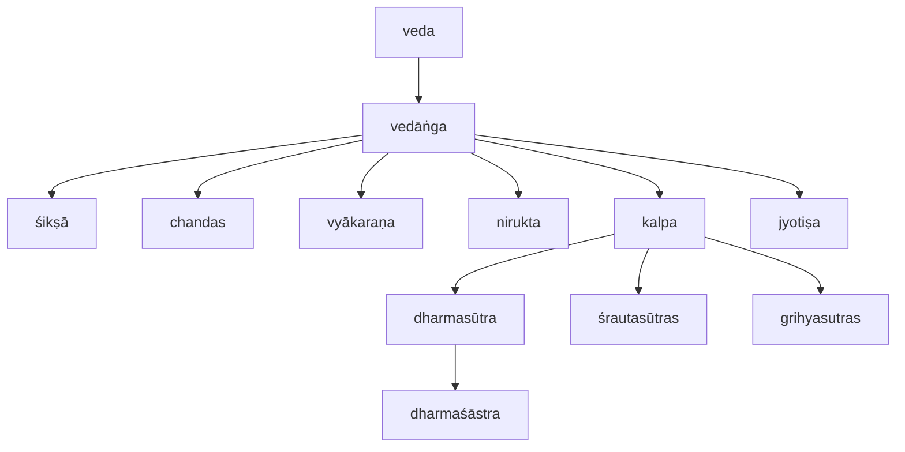

> According to Indian ethos only Vedas are pramāṇas or authority Abhijñāna Śākuntala they have come from Gods direct, being apauruṣeya and have been revealed to ancient Ṛṣis who are mantra draṣṭāraḥ. After Vedas, prominence is in the order of Āgama, Smṛti, Itihāsa and Purāṇa, if they are not contradicting with vedapramāṇa (Vide Tamil Commentary on Śiva Gītā 3).

